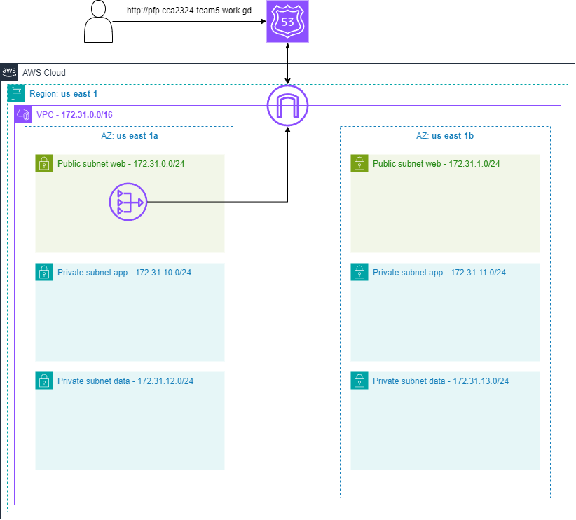

# Infrastructure creation
## Pre-requisites
If not done previously, create a remote backend for the Terraform state locking (see this [README.md](./init-backend/README.md)). But, as the prior document says, it is not necessary since the backend **is already created**.

## Steps

1. Clone the repository in our AWS account. This account is provate, so we need the authorization of the owners to clone the repository. 

```bash
    git clone https://github.com/ivanocat/CCA2324-TEAM5.git
```

2. Initialize the working directory containing Terraform configuration files:

```bash
    terraform init
```

3. Preview the changes that Terraform plans to make to the infrastructure:

```bash
    terraform plan
```

4. Execute the actions proposed in a Terraform plan. The `-auto-approve` flag skips interactive approval of plan before applying:

```bash
    terraform apply -auto-approve
```


## Expected infrastructure
The following image shows the infrastructure that comprises the project:


